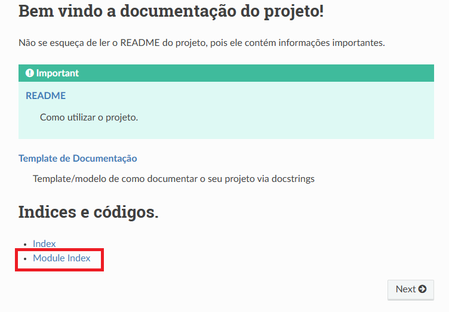
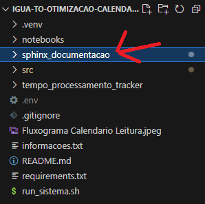
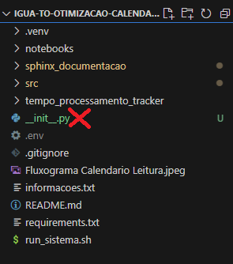

# Documentador de projetos Sphinx

## Introdução:

Projeto com a finalidade de gerar documentação para projetos.

## Documentação

* Você pode acessar a documentação gerada pelo caminho 'documentos/\_build/html/index.html'

* Para visualizar as funções documentadas: index.html > Module Index



## Execução:

* Executar main.ipynb para geração de documentação.

* Antes de rodar o sistema, é importante determinar algumas coisas:

  ```bash
  Qual será o caminho do source (o que será documentado). 

      Existe 2 lugares que precisam ser configurados:

          - main.ipynb

          - conf.py (localizado em documentos/)
  ```

  ```bash
  Adicionar __init__.py a cada pasta que deseja documentar
  ```

* <b> Importante:</b>

  ```{warning}
  O projeto do Sphinx deve estar na mesma pasta do projeto que deseja documentar, ou seja, dentro da raiz do repositório ou próximo aos arquivos Python com as docstrings.
  ```

  

  ```{warning}
  Não deve existir nenhum arquivo __init__.py na pasta raiz do projeto que será documentado, pois isso impede a geração da model index.
  ```

  

## Pré-requisito:

É necessário que a pasta source, que deseja documentar, esteja com as docstrings inseridas aos arquivos .py desejados.

## Output:

O output será um html com toda a documentação gerada, localizado em documentos/\_build.

```{warning}
As pastas _build e apidoc só serão geradas após a rodagem do sistema.
```
